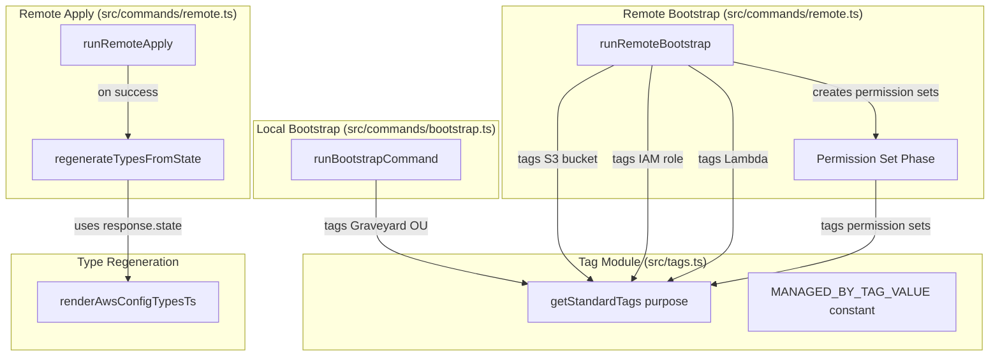

# Design Document: Bootstrap Enhancements

## Overview

This feature enhances the existing bootstrap commands with consistent AWS resource tagging, IAM Identity Center permission set creation, automatic type regeneration after remote apply, and resolution of code review TODO comments. The design introduces a centralized tag module, extends `runRemoteBootstrap` with permission set provisioning, adds a post-apply regeneration step to `runRemoteApply`, and addresses code quality improvements across multiple source files.

### Key Design Decisions

1. **Centralized tag module** (`src/tags.ts`) — a single source of truth for all resource tags, avoiding inline tag construction scattered across bootstrap commands.
2. **Permission set creation as a separate phase** within remote bootstrap — runs after Lambda deployment, uses the existing `SSOAdminClient` pattern, and is skipped gracefully when Identity Center is not configured.
3. **Post-apply regeneration uses the response state directly** — avoids an extra remote scan by feeding the `state` field from the Lambda apply response into the type generation logic.
4. **TODO resolution as refactoring tasks** — each TODO is addressed independently, grouped by file, with no behavioral changes to the system.

## Architecture



## Components and Interfaces

### 1. Tag Module (`src/tags.ts`)

New module providing centralized tag generation.

```typescript
/** Constant value for the ManagedBy tag */
export const MANAGED_BY_TAG_VALUE = "beesolve-aws-accounts" as const;

/** AWS SDK tag format */
export type AwsTag = { Key: string; Value: string };

/**
 * Generate the standard tag set for a managed resource.
 * @param purpose - Non-empty string (max 64 chars) describing the resource purpose
 * @throws Error if purpose is empty
 */
export function getStandardTags(purpose: string): AwsTag[];
```

### 2. Remote Bootstrap Extensions (`src/commands/remote.ts`)

Extended `runRemoteBootstrap` with:
- Tag application on S3 bucket creation (via `PutBucketTagging` for existing buckets, `CreateBucket` doesn't support tags directly — use `PutBucketTagging` after creation)
- Tag application on IAM role creation (via `TagRole` / `CreateRole` Tags parameter)
- Tag application on Lambda function creation (via `CreateFunction` Tags parameter / `TagResource` for existing)
- Permission set creation phase after Lambda deployment

```typescript
/** Creates or updates the OrganizationManagement permission set */
async function ensureOrganizationManagementPermissionSet(props: {
  ssoAdminClient: SSOAdminClient;
  instanceArn: string;
  tags: AwsTag[];
  logger: Logger;
}): Promise<{ permissionSetArn: string }>;

/** Creates or updates the OrganizationRemoteManagement permission set */
async function ensureOrganizationRemoteManagementPermissionSet(props: {
  ssoAdminClient: SSOAdminClient;
  instanceArn: string;
  lambdaArn: string;
  tags: AwsTag[];
  logger: Logger;
}): Promise<{ permissionSetArn: string }>;
```

### 3. Local Bootstrap Extensions (`src/commands/bootstrap.ts`)

Extended `createMissingRequiredOus` and the existing-OU path to apply tags:
- `CreateOrganizationalUnitCommand` with `Tags` parameter for new OUs
- `TagResourceCommand` for existing Graveyard OU

### 4. Post-Apply Type Regeneration (`src/commands/remote.ts`)

New helper function called after successful apply:

```typescript
/** Regenerate aws.config.types.ts from the provided state without user confirmation */
async function regenerateTypesFromState(props: {
  state: StateFile;
  contextPath: string;
  configPath: string;
  typesPath: string;
  logger: Logger;
}): Promise<void>;
```

This function:
- Maps the state to an `AwsConfigModel` using existing `mapStateToAwsConfig`
- Renders the types file using existing `renderAwsConfigTypesTs`
- Compares with current file content
- Writes only if changed (no user confirmation needed — apply already confirmed)
- Logs on change, silent on no-change
- Catches and logs errors without re-throwing

### 5. TODO Resolution (Refactoring)

Code quality improvements across files:

| File | Change |
|------|--------|
| `src/lambda/handler.ts` | Remove `as const` on literal booleans, pass AWS clients through props, parallelize scan calls, use `assertUnreachable` |
| `src/commands/remote.ts` | Infer `RemoteCommandInput` type from valibot, align cache/state config, extract lambda zip reading helper, pass AWS clients as props, remove `as any`, parallelize Promise.all, use `assertUnreachable` |
| `src/lambdaClient.ts` | Refactor `let` patterns to early-return or IIFE, use `assertUnreachable` |
| `src/cli.ts` | Use `assertUnreachable` for remote subcommands |
| `src/awsConfig.ts` | Remove unnecessary `await` in `readAwsContextFromFile` |

## Data Models

### Standard Tag Set

```typescript
type AwsTag = { Key: string; Value: string };

// Example output of getStandardTags("state-storage"):
[
  { Key: "ManagedBy", Value: "beesolve-aws-accounts" },
  { Key: "Purpose", Value: "state-storage" }
]
```

### Purpose Values by Resource

| Resource | Purpose Value |
|----------|--------------|
| S3 state bucket | `state-storage` |
| IAM execution role | `execution-role` |
| Lambda function | `remote-execution` |
| Graveyard OU | `graveyard` |
| OrganizationManagement permission set | `organization-management` |
| OrganizationRemoteManagement permission set | `remote-invocation` |

### Permission Set Configurations

**OrganizationManagement:**
```json
{
  "sessionDuration": "PT4H",
  "description": "Full organization management access for AWS Organizations, IAM Identity Center, and IAM",
  "inlinePolicy": {
    "Version": "2012-10-17",
    "Statement": [{
      "Effect": "Allow",
      "Action": ["organizations:*", "sso:*", "identitystore:*", "account:*", "iam:*"],
      "Resource": "*"
    }]
  }
}
```

**OrganizationRemoteManagement:**
```json
{
  "sessionDuration": "PT1H",
  "description": "Minimal access to invoke the beesolve-aws-accounts remote management Lambda",
  "inlinePolicy": {
    "Version": "2012-10-17",
    "Statement": [{
      "Effect": "Allow",
      "Action": ["lambda:InvokeFunction"],
      "Resource": "<lambdaArn from context>"
    }]
  }
}
```

## Correctness Properties

*A property is a characteristic or behavior that should hold true across all valid executions of a system — essentially, a formal statement about what the system should do. Properties serve as the bridge between human-readable specifications and machine-verifiable correctness guarantees.*

### Property 1: Tag generation produces correct structure and content

*For any* non-empty string `purpose` with length between 1 and 64 characters, calling `getStandardTags(purpose)` SHALL return an array of exactly 2 elements where the first has `Key: "ManagedBy"` and `Value: "beesolve-aws-accounts"`, and the second has `Key: "Purpose"` and `Value` equal to the provided `purpose` string.

**Validates: Requirements 1.4, 4.1, 4.3**

### Property 2: Empty purpose string is rejected

*For any* string that is empty (length 0), calling `getStandardTags` with that string SHALL throw an Error.

**Validates: Requirements 4.5**

## Error Handling

### Tag Application Failures

- **Remote bootstrap**: If any AWS tagging API call fails (S3 `PutBucketTagging`, IAM `TagRole`, Lambda `TagResource`), the error propagates immediately and halts bootstrap. No partial cleanup is attempted — the user re-runs bootstrap which is idempotent.
- **Local bootstrap**: If `TagResourceCommand` fails for the Graveyard OU, the error propagates and halts bootstrap.

### Permission Set Failures

- If one permission set creation/update fails, the error is logged and the other permission set is still attempted. This allows partial success — the user can re-run to fix the failed one.
- If Identity Center is not configured (no `identityCenter` in context), permission set creation is skipped entirely with a warning log.

### Type Regeneration Failures

- If regeneration fails after a successful apply (e.g., file write error, config parse error), a warning is logged but the apply result is not affected. The user can manually run `aws-accounts regenerate` to recover.

### TODO Refactoring

- Refactoring changes must not alter observable behavior. Each change is verified by the existing test suite passing.

## Testing Strategy

### Unit Tests (Example-Based)

Unit tests cover the integration behavior of bootstrap commands with mocked AWS clients:

- **Remote bootstrap tagging**: Verify each resource creation/update call includes correct tags
- **Remote bootstrap idempotent tagging**: Verify tags are applied when resources already exist
- **Local bootstrap tagging**: Verify Graveyard OU creation includes tags, and existing OU gets tagged
- **Permission set creation**: Verify both permission sets are created with correct configuration
- **Permission set idempotent update**: Verify existing permission sets are updated
- **Permission set skip on missing Identity Center**: Verify graceful skip with warning
- **Permission set partial failure**: Verify one failure doesn't block the other
- **Post-apply regeneration**: Verify regeneration is called with response state
- **Post-apply regeneration failure**: Verify warning logged, apply not failed
- **Post-apply no-change**: Verify no log when types unchanged

### Property-Based Tests

Property-based tests verify the tag module's universal correctness guarantees using `fast-check`:

- **Property 1**: Tag generation correctness — minimum 100 iterations with random valid purpose strings
- **Property 2**: Empty purpose rejection — minimum 100 iterations (trivial but validates the guard)

Tag format: `Feature: bootstrap-enhancements, Property 1: Tag generation produces correct structure and content`

### Existing Test Preservation

- All existing tests in `handler.test.ts`, `handler.property5.test.ts`, `handler.property6.test.ts` must continue passing after refactoring
- The handler test split (3 files due to `mock.module()` before import) is an inherent Node.js test runner constraint and should remain as-is unless the refactoring to pass clients via props eliminates the need for module-level mocks

### Refactoring Verification

Each TODO resolution is verified by:
1. TypeScript type-checking passes (`npm run typecheck`)
2. Full test suite passes (`npm run test`)
3. No behavioral changes — only internal code quality improvements
