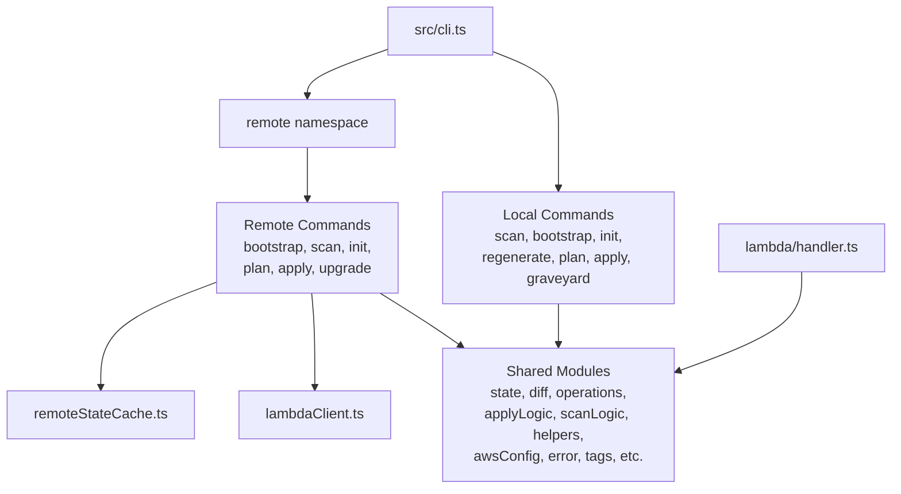
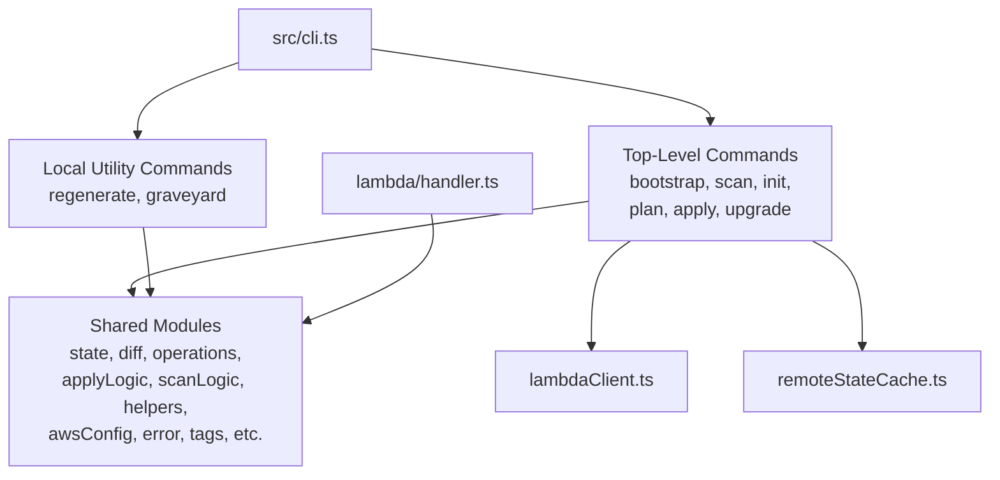

# Design Document: Local Extraction and Removal

## Overview

This design describes the restructuring of the @beesolve/aws-accounts codebase to remove the local execution model and retain only the remote (Lambda-based) execution model. The work is split into three sequential phases:

1. **Phase 1 — Extraction**: Copy all local execution code into a self-contained `local/` folder at the repository root, with its own `package.json`, `tsconfig.json`, and build scripts. Commit this as a discrete recovery point.
2. **Phase 2 — Removal**: Delete local-specific command files from `src/`, promote remote subcommands to top-level CLI commands, remove the `remote` namespace, and update the CLI entry point.
3. **Phase 3 — Cleanup**: Remove unused shared module exports, dead dependencies, and update documentation (README, ADR, docs/).

The key constraint is that Phase 1 must be committed before Phase 2 begins, providing a git-recoverable snapshot of the local-first version.

## Architecture

### Current State



### Target State (After Phase 2+3)



### Extraction Folder Structure

```text
local/
├── package.json
├── tsconfig.json
├── src/
│   ├── cli.ts              (local-only CLI, no remote subcommand)
│   ├── state.ts
│   ├── state.test.ts
│   ├── diff.ts
│   ├── diff.test.ts
│   ├── operations.ts
│   ├── applyLogic.ts
│   ├── scanLogic.ts
│   ├── helpers.ts
│   ├── helpers.test.ts
│   ├── awsConfig.ts
│   ├── awsConfig.test.ts
│   ├── awsConfig.regeneration.test.ts
│   ├── awsClientConfig.ts
│   ├── error.ts
│   ├── error.test.ts
│   ├── tags.ts
│   ├── accountCreation.ts
│   ├── reservedOuDeletion.ts
│   ├── logger.ts
│   └── commands/
│       ├── scan.ts
│       ├── scan.test.ts
│       ├── bootstrap.ts
│       ├── bootstrap.test.ts
│       ├── init.ts
│       ├── init.test.ts
│       ├── regenerate.ts
│       ├── regenerate.test.ts
│       ├── plan.ts
│       ├── plan.test.ts
│       ├── apply.ts
│       ├── apply.test.ts
│       ├── graveyard.ts
│       └── graveyard.test.ts
```

## Components and Interfaces

### Phase 1: Extraction Component

**Responsibility**: Create a complete, self-contained copy of the local execution code.

| Action                       | Details                                                                                                                                                                                                                                                                                       |
| ---------------------------- | --------------------------------------------------------------------------------------------------------------------------------------------------------------------------------------------------------------------------------------------------------------------------------------------- |
| Create `local/package.json`  | Include all dependencies needed for local execution: @aws-sdk/client-organizations, @aws-sdk/client-sso-admin, @aws-sdk/client-identitystore, @aws-sdk/client-account, @aws-sdk/client-sts, @aws-sdk/credential-providers, @beesolve/iam-policy-ts, esbuild, valibot, typescript, @types/node |
| Create `local/tsconfig.json` | Standalone config: `target: ES2022`, `module: NodeNext`, `moduleResolution: NodeNext`, `noEmit: true`, `allowImportingTsExtensions: true`, `strict: true`                                                                                                                                     |
| Copy shared modules          | All modules listed in Requirement 1.2 into `local/src/`                                                                                                                                                                                                                                       |
| Copy local commands          | All 7 local command files + their test files into `local/src/commands/`                                                                                                                                                                                                                       |
| Create local CLI             | Modified `cli.ts` that only registers scan, bootstrap, init, regenerate, plan, apply, graveyard — no remote subcommand                                                                                                                                                                        |
| Exclude remote code          | No lambda/, lambdaClient.ts, remoteStateCache.ts, remote.ts, buildLambda.ts                                                                                                                                                                                                                   |

**Build script in `local/package.json`**:

```json
{
  "scripts": {
    "build": "esbuild $(find src -name '*.ts' ! -name '*.test.ts') --platform=node --target=node24 --format=esm --outdir=dist --outbase=src && chmod +x dist/cli.js",
    "typecheck": "tsc --noEmit"
  }
}
```

### Phase 2: Removal Component

**Responsibility**: Remove local-specific code and promote remote commands.

| Action                                   | Details                                                                                                                                                                       |
| ---------------------------------------- | ----------------------------------------------------------------------------------------------------------------------------------------------------------------------------- |
| Delete local command files               | `src/commands/{scan,bootstrap,init,plan,apply}.ts` — retain `regenerate.ts` and `graveyard.ts`                                                                                |
| Delete local test files                  | `src/commands/{scan,bootstrap,init,plan,apply}.test.ts` — retain `regenerate.test.ts` and `graveyard.test.ts`                                                                 |
| Rewrite `src/cli.ts`                     | Remove local command imports for deleted commands, remove `remote` namespace, promote remote commands to top-level, retain `regenerate` and `graveyard` as top-level commands |
| Rename/refactor `src/commands/remote.ts` | Keep the implementation but remove the `remote` subcommand routing; each function becomes a direct top-level command handler                                                  |
| Update `graveyard.ts`                    | Change state source from `state.json` to `.remote-state-cache.json` since the cache is updated after every `scan` and `apply`                                                 |
| Update help text                         | List: bootstrap, scan, init, regenerate, graveyard, plan, apply, upgrade                                                                                                      |
| Update `package.json` description        | Change from "Local-first AWS Organizations..." to "AWS Organizations and IAM Identity Center management CLI"                                                                  |
| Retain `local/` folder                   | Not deleted in this phase                                                                                                                                                     |

**New CLI command routing** (post-removal):

```typescript
const commands = [
  "bootstrap",
  "scan",
  "init",
  "regenerate",
  "graveyard",
  "plan",
  "apply",
  "upgrade",
] as const;
```

### Phase 3: Cleanup Component

**Responsibility**: Remove dead code, unused dependencies, and update documentation.

| Action              | Details                                                                                  |
| ------------------- | ---------------------------------------------------------------------------------------- |
| Analyze imports     | Static analysis of remaining `src/` to find unused exports in shared modules             |
| Remove dead exports | Functions/types/constants with zero import references from remote path or Lambda handler |
| Remove unused deps  | Dependencies with zero import references in `src/` or `scripts/`                         |
| Create ADR          | `docs/adr/001-remove-local-execution-model.md` with commit hash, rationale, file list    |
| Update README       | Remove local references, update command examples, update IAM permissions section         |
| Update docs/        | Annotate any files referencing local model as current architecture                       |

### Shared Module Retention Analysis

Modules imported by Lambda handler (`src/lambda/handler.ts`):

- `operations.ts` (operationSchema, Operation)
- `state.ts` (stateSchema, StateFile, createWorkingState, materializeWorkingState)
- `scanLogic.ts` (scanOrganization, scanIdentityCenter)
- `applyLogic.ts` (executeOperation)
- `helpers.ts` (assertUnreachable)

Modules imported by remote commands (`src/commands/remote.ts`):

- `awsConfig.ts` (loadAwsConfigModelFromTsFile, mapAwsConfigToState, readAwsContextFromFile, regenerateTypesFromState, writeAwsConfigFromState, AwsContextFile, Deployment)
- `awsClientConfig.ts` (buildAwsClientConfig)
- `tags.ts` (getStandardTags, AwsTag)
- `diff.ts` (diffStates)
- `lambdaClient.ts` (invokeLambda)
- `logger.ts` (Logger)
- `operations.ts` (Operation, Plan)
- `remoteStateCache.ts` (isCacheFresh, readStateCache, writeStateCache)
- `reservedOuDeletion.ts` (applyReservedOuDeletionGuard)
- `state.ts` (validateState, StateFile)
- `helpers.ts` (assertUnreachable, delay)
- `error.ts` (via cli.ts)

**Retained modules**: All current shared modules are imported by either the Lambda handler or remote commands. The `accountCreation.ts` module needs verification — if it's only imported by `applyLogic.ts` (which is used by both paths), it stays. If it's only imported by local `apply.ts`, it can be removed.

## Data Models

No new data models are introduced. The existing `StateFile`, `Operation`, `Plan`, and `AwsContextFile` types remain unchanged. The state schema, operation schema, and config file formats are unaffected by this restructuring.

The only data change is the `package.json` description field update (Requirement 3.9).

## Correctness Properties

_Property-based testing is NOT applicable for this feature._ This is a code restructuring task — file moves, deletions, CLI rewiring, and documentation updates. There are no pure functions with varying inputs, no data transformations, and no parsers or serializers being introduced. The correctness criteria are structural (files exist, imports resolve, commands route correctly) rather than behavioral across an input space.

The following structural invariants serve as verifiable correctness checks for the restructuring:

### Property 1: Extraction folder import self-containment

All import statements within the `local/` extraction folder SHALL resolve to paths within the `local/` directory tree. No import references any file outside `local/`.

**Validates: Requirements 1.1, 1.2**

### Property 2: Main src/ tree has no dangling references after removal

All import statements in the remaining `src/` tree SHALL resolve to existing files after local command deletion. No import references a deleted local command file or removed shared module.

**Validates: Requirements 3.4, 3.5, 3.7, 3.8, 5.7**

### Property 3: CLI command set matches specification after removal

The CLI command set after removal SHALL be exactly: `bootstrap`, `scan`, `init`, `regenerate`, `graveyard`, `plan`, `apply`, `upgrade`. The `regenerate` and `graveyard` commands are retained as local utility commands that do not invoke AWS SDK. No `remote` namespace remains.

**Validates: Requirements 3.1, 3.2, 3.3, 3.11**

### Property 4: Lambda handler behavioral equivalence

The Lambda handler (`src/lambda/handler.ts`) SHALL continue to function identically — its imports, logic, and behavior are unchanged by the restructuring since it only depends on shared modules that are retained.

**Validates: Requirements 3.7, 5.6**

## Error Handling

### Phase 1 Validation

- `tsc --noEmit` in `local/` must pass — catches missing imports or broken references
- `npm install && npm run build` in `local/` must succeed — catches missing dependencies
- CLI `--help` must exit 0 — catches broken entry point

### Phase 2 Validation

- `npm run typecheck` must pass — catches dangling imports to deleted files
- `npm run build` must succeed — catches build script issues
- `npm run test` must pass — catches broken test imports or logic

### Phase 3 Validation

- Same as Phase 2, plus `npm run build:lambda` must succeed
- No import statements referencing deleted files

### Error Scenarios

| Scenario                                                            | Mitigation                                                      |
| ------------------------------------------------------------------- | --------------------------------------------------------------- |
| Shared module has local-only exports mixed with remote-used exports | Phase 3 removes only unused exports, not entire files           |
| Test file imports a deleted command                                 | Phase 2 deletes local test files; remote test files are updated |
| Circular dependency in extraction                                   | Copy all shared modules wholesale; no selective extraction      |
| Missing dependency in `local/package.json`                          | Validate with `npm install && tsc --noEmit` before committing   |

## Testing Strategy

**PBT Assessment**: Property-based testing is NOT appropriate for this feature. This is a code restructuring task — file moves, deletions, CLI rewiring, and documentation updates. There are no pure functions with varying inputs, no data transformations, no parsers or serializers being introduced. The correctness criteria are structural (files exist, imports resolve, commands route correctly) rather than behavioral across an input space.

**Testing approach**:

### Phase 1 Tests (Extraction Integrity)

- **Compilation check**: `tsc --noEmit` passes in `local/` (verifies all imports resolve)
- **Build check**: `npm run build` produces `dist/cli.js` in `local/`
- **CLI smoke test**: `node dist/cli.js --help` exits 0
- **CLI unknown command test**: `node dist/cli.js unknown` exits non-zero
- **No remote references**: grep for `remote`, `lambda`, `lambdaClient` in `local/src/` returns no hits

### Phase 2 Tests (Removal Integrity)

- **Compilation check**: `npm run typecheck` passes
- **Build check**: `npm run build` succeeds
- **Existing remote tests pass**: `npm test` runs remote.test.ts, remote.permissionset.test.ts, remote.tagging.test.ts successfully
- **Retained local utility tests pass**: `npm test` runs regenerate.test.ts, graveyard.test.ts successfully
- **CLI help check**: Help output lists bootstrap, scan, init, regenerate, graveyard, plan, apply, upgrade
- **No local command references**: No imports of deleted files in remaining `src/`

### Phase 3 Tests (Cleanup Integrity)

- **Full test suite**: `npm test` passes
- **Lambda build**: `npm run build:lambda` succeeds
- **Type check**: `npm run typecheck` passes
- **No dead imports**: No import statements referencing removed modules
