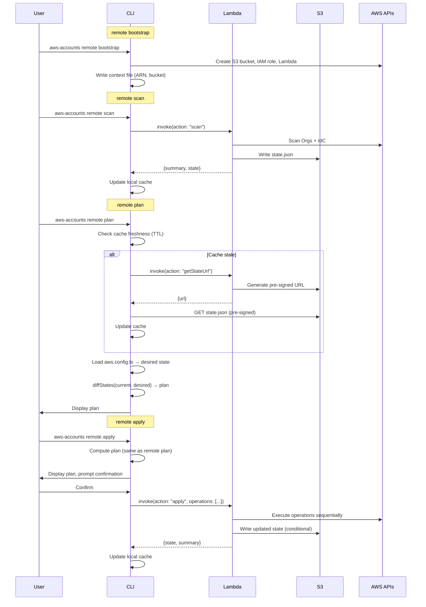
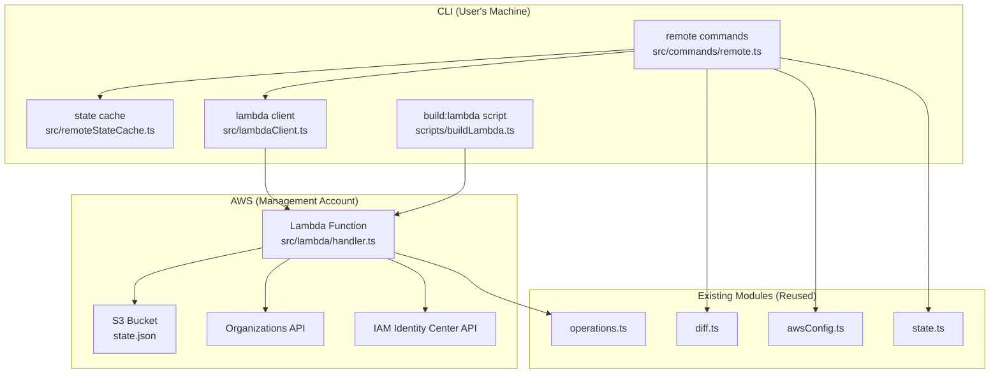
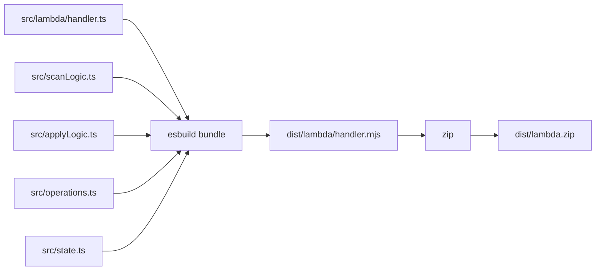

# Design Document: Remote Execution V2

## Overview

Remote Execution V2 extends the `@beesolve/aws-accounts` CLI with a `remote` command group that delegates AWS SDK operations to a Lambda function while keeping plan computation local. The architecture follows a clear separation: the CLI owns configuration parsing, state diffing, and user interaction; the Lambda owns AWS API execution and state persistence on S3.

The design prioritizes minimal disruption to existing code through a seam-based refactoring approach — existing modules (`diff.ts`, `operations.ts`, `state.ts`) are reused directly, and new code is added alongside rather than modifying existing command implementations.

### Key Design Decisions

- **CLI never talks to S3 directly** — all state access goes through Lambda (pre-signed URLs for reads, Lambda writes for mutations)
- **Plan computation is always local** — CLI loads `aws.config.ts`, fetches state via Lambda pre-signed URL, diffs locally
- **Apply execution is remote** — CLI sends operations to Lambda, Lambda executes them sequentially
- **Lambda concurrency = 1** — combined with S3 conditional writes, this provides state locking
- **No CloudFormation** — bootstrap uses raw SDK calls
- **Single Lambda file** — all handler logic in one file, routed by `action` field

## Architecture



### Component Diagram



## Components and Interfaces

### New Modules

#### `src/commands/remote.ts` — Remote Command Group

The top-level entry point for all `remote` subcommands. Handles argument parsing for the `remote` command group and dispatches to individual subcommand handlers.

**Responsibilities:**

- Parse `remote <subcommand>` from CLI args
- Dispatch to `remoteBootstrap`, `remoteScan`, `remotePlan`, `remoteApply`, `remoteUpgrade`
- Share `--profile`, `--region` flag handling with existing CLI infrastructure

**Interface:**

```typescript
type RemoteCommandInput = {
  subcommand: "bootstrap" | "scan" | "plan" | "apply" | "upgrade";
  profile: string | undefined;
  region: string | undefined;
  flags: {
    yes: boolean;
    refresh: boolean; // for plan --refresh
    allowDestructive: boolean;
    ignoreUnsupported: boolean;
  };
  logger: Logger;
};
```

#### `src/lambdaClient.ts` — Lambda Invocation Client

Wraps `@aws-sdk/client-lambda` to invoke the remote Lambda function and parse responses. This is the single point of communication between CLI and Lambda.

**Responsibilities:**

- Invoke Lambda with typed request payloads
- Parse and validate Lambda responses using valibot schemas
- Map Lambda errors to CLI-friendly error messages (including concurrency conflicts)

**Interface:**

```typescript
type InvokeLambdaProps = {
  lambdaClient: LambdaClient;
  lambdaArn: string;
  payload: LambdaRequestPayload;
};

type LambdaInvokeResult =
  | { ok: true; response: LambdaResponsePayload }
  | { ok: false; error: LambdaInvokeError };

type LambdaInvokeError =
  | { kind: "validation"; details: string }
  | { kind: "concurrencyConflict"; message: string }
  | {
      kind: "operationFailed";
      failedOperation: number;
      totalOperations: number;
      error: string;
      partialState: StateFile;
    }
  | { kind: "invocationError"; message: string };

export async function invokeLambda(props: InvokeLambdaProps): Promise<LambdaInvokeResult>;
```

#### `src/remoteStateCache.ts` — State Cache Management

Manages the local cache of remote state with TTL-based freshness checking.

**Responsibilities:**

- Read/write `.remote-state-cache.json`
- Determine cache freshness based on TTL from context file
- Support `--refresh` flag to bypass cache

**Interface:**

```typescript
type StateCacheFile = {
  fetchedAt: string; // ISO 8601 timestamp
  state: StateFile;
};

type CacheFreshnessResult = { fresh: true; state: StateFile } | { fresh: false };

export async function readStateCache(cachePath: string): Promise<StateCacheFile | null>;
export async function writeStateCache(cachePath: string, state: StateFile): Promise<void>;
export function isCacheFresh(cache: StateCacheFile, ttlSeconds: number): boolean;
```

#### `src/lambda/handler.ts` — Lambda Handler (Single File)

The Lambda function entry point. Routes on `action` field, validates inputs/outputs with valibot, executes AWS SDK operations.

**Responsibilities:**

- Validate incoming event against request schema
- Route to action handler (`scan`, `getStateUrl`, `apply`)
- Execute AWS SDK operations (reusing operation execution logic from `apply.ts`)
- Write state to S3 with conditional writes
- Validate response before returning

**Interface:**

```typescript
// Lambda entry point
export async function handler(event: unknown): Promise<LambdaResponse>;
```

#### `scripts/buildLambda.ts` — Lambda Build Script

Produces `dist/lambda.zip` from `src/lambda/handler.ts` using esbuild.

**Responsibilities:**

- Bundle handler.ts into single ESM file with esbuild
- Exclude `@aws-sdk/*` packages (provided by Lambda runtime)
- Target Node.js 24
- Zip the bundle into `dist/lambda.zip`

### Seam-Based Refactoring Approach

The existing codebase is reused with minimal changes:

| Existing Module         | How It's Reused                                                                                           | Changes Needed                                                                                                                      |
| ----------------------- | --------------------------------------------------------------------------------------------------------- | ----------------------------------------------------------------------------------------------------------------------------------- |
| `src/diff.ts`           | `diffStates()` called by `remotePlan` with cached state                                                   | None                                                                                                                                |
| `src/operations.ts`     | `operationSchema` used by Lambda to validate incoming operations                                          | None — schema is already exported                                                                                                   |
| `src/state.ts`          | `StateFile` type, `validateState()`, state manipulation functions used by Lambda                          | None — already exported                                                                                                             |
| `src/awsConfig.ts`      | `loadAwsConfigModelFromTsFile()`, `mapAwsConfigToState()`, `readAwsContextFromFile()` used by remote plan | Add `stateCacheTtlSeconds` to context schema                                                                                        |
| `src/commands/scan.ts`  | Scan logic extracted/reused by Lambda handler                                                             | Extract `scanOrganization` and `scanIdentityCenter` into importable functions (or duplicate in Lambda since it's a separate bundle) |
| `src/commands/apply.ts` | Operation execution logic reused by Lambda handler                                                        | Extract `executeOperation` helper (currently inline in apply loop)                                                                  |
| `src/cli.ts`            | Add `remote` command group to argument parsing                                                            | Add remote command routing                                                                                                          |

**Key insight:** Since the Lambda is bundled separately via `build:lambda`, it can import from shared source files at build time. The scan and apply execution logic can be extracted into shared modules that both the CLI and Lambda import.

### Shared Extraction Plan

```
src/scanLogic.ts        — scanOrganization(), scanIdentityCenter() extracted from scan.ts
src/applyLogic.ts       — executeOperation() extracted from apply.ts (the switch/case on operation.kind)
```

Both `src/commands/scan.ts` and `src/lambda/handler.ts` import from `src/scanLogic.ts`.
Both `src/commands/apply.ts` and `src/lambda/handler.ts` import from `src/applyLogic.ts`.

This avoids code duplication while keeping the Lambda bundle self-contained after esbuild resolves imports.

## Data Models

### Lambda Event Schemas (Request)

```typescript
import * as v from "valibot";
import { operationSchema } from "../operations.js";

// Base event structure
const scanRequestSchema = v.strictObject({
  action: v.literal("scan"),
});

const getStateUrlRequestSchema = v.strictObject({
  action: v.literal("getStateUrl"),
});

const applyRequestSchema = v.strictObject({
  action: v.literal("apply"),
  operations: v.pipe(v.array(operationSchema), v.minLength(1)),
  allowDestructive: v.boolean(),
});

export const lambdaRequestSchema = v.variant("action", [
  scanRequestSchema,
  getStateUrlRequestSchema,
  applyRequestSchema,
]);

export type LambdaRequestPayload = v.InferOutput<typeof lambdaRequestSchema>;
```

### Lambda Response Schemas

```typescript
const scanResponseSchema = v.strictObject({
  action: v.literal("scan"),
  success: v.literal(true),
  summary: v.strictObject({
    organizationalUnits: v.number(),
    accounts: v.number(),
    users: v.number(),
    groups: v.number(),
    permissionSets: v.number(),
    accountAssignments: v.number(),
  }),
  state: stateSchema, // full state returned for cache update
});

const getStateUrlResponseSchema = v.strictObject({
  action: v.literal("getStateUrl"),
  success: v.literal(true),
  url: v.string(),
  expiresInSeconds: v.number(),
});

const applySuccessResponseSchema = v.strictObject({
  action: v.literal("apply"),
  success: v.literal(true),
  operationsCompleted: v.number(),
  state: stateSchema,
});

const errorResponseSchema = v.strictObject({
  success: v.literal(false),
  error: v.strictObject({
    kind: v.picklist(["validation", "concurrencyConflict", "operationFailed", "internal"]),
    message: v.string(),
    details: v.optional(
      v.strictObject({
        failedOperation: v.optional(v.number()),
        operationsCompleted: v.optional(v.number()),
        partialState: v.optional(stateSchema),
        validationIssues: v.optional(v.array(v.string())),
      }),
    ),
  }),
});

export const lambdaResponseSchema = v.union([
  scanResponseSchema,
  getStateUrlResponseSchema,
  applySuccessResponseSchema,
  errorResponseSchema,
]);

export type LambdaResponsePayload = v.InferOutput<typeof lambdaResponseSchema>;
```

### State Cache File Schema

```typescript
const stateCacheSchema = v.strictObject({
  fetchedAt: v.string(), // ISO 8601
  state: stateSchema,
});

export type StateCacheFile = v.InferOutput<typeof stateCacheSchema>;
```

### Context File Extension

The existing `deployment` key in `aws.context.json` is extended:

```typescript
deployment: v.strictObject({
  profile: v.string(),
  region: v.string(),
  lambdaArn: v.string(),
  stateBucketName: v.string(),
  stateCacheTtlSeconds: v.number(),  // NEW — default 300 (5 minutes)
}),
```

### S3 Bucket Naming Convention

```
beesolve-aws-accounts-state-{accountId}-{region}
```

Example: `beesolve-aws-accounts-state-123456789012-us-east-1`

### IAM Execution Role Policy

```typescript
const lambdaExecutionRolePolicy = {
  Version: "2012-10-17",
  Statement: [
    {
      Effect: "Allow",
      Action: ["organizations:*"],
      Resource: "*",
    },
    {
      Effect: "Allow",
      Action: ["sso:*", "identitystore:*"],
      Resource: "*",
    },
    {
      Effect: "Allow",
      Action: ["s3:GetObject", "s3:PutObject", "s3:ListBucket"],
      Resource: [`arn:aws:s3:::${bucketName}`, `arn:aws:s3:::${bucketName}/*`],
    },
    {
      Effect: "Allow",
      Action: ["logs:CreateLogGroup", "logs:CreateLogStream", "logs:PutLogEvents"],
      Resource: "arn:aws:logs:*:*:*",
    },
    {
      Effect: "Allow",
      Action: ["account:PutAccountName"],
      Resource: "*",
    },
  ],
};
```

## Build Pipeline for `lambda.zip`



**`scripts/buildLambda.ts`** implementation outline:

```typescript
import { build } from "esbuild";
import { createWriteStream } from "node:fs";
import { readFile } from "node:fs/promises";
import { join } from "node:path";
import { Writable } from "node:stream";
import { ZipWriter, BlobReader } from "@zip.js/zip.js"; // or use archiver/yazl

await build({
  entryPoints: ["src/lambda/handler.ts"],
  bundle: true,
  platform: "node",
  target: "node24",
  format: "esm",
  outfile: "dist/lambda/handler.mjs",
  external: ["@aws-sdk/*"],
  minify: false, // keep readable for debugging
  sourcemap: false,
});

// Zip dist/lambda/handler.mjs → dist/lambda.zip
// Using Node.js built-in zlib or a lightweight zip library
```

**`package.json` script addition:**

```json
{
  "scripts": {
    "build:lambda": "node scripts/buildLambda.ts"
  }
}
```

Node.js 24+ has built-in TypeScript type stripping enabled by default — no loader or `tsx` dependency needed.

## Correctness Properties

_A property is a characteristic or behavior that should hold true across all valid executions of a system — essentially, a formal statement about what the system should do. Properties serve as the bridge between human-readable specifications and machine-verifiable correctness guarantees._

### Property 1: Lambda input validation rejects invalid payloads

_For any_ JSON payload that does not conform to the `lambdaRequestSchema`, the Lambda handler SHALL return an error response with `kind: "validation"` and a non-empty `message` describing the validation failure.

**Validates: Requirements 3.1, 3.2, 11.1**

### Property 2: Cache freshness determination

_For any_ cache timestamp and TTL value in seconds, `isCacheFresh` SHALL return `true` if and only if the elapsed time since the cache timestamp is less than or equal to the TTL value.

**Validates: Requirements 5.1, 5.2, 7.3**

### Property 3: State cache round-trip

_For any_ valid `StateFile`, writing it to the state cache and then reading it back SHALL produce an identical `StateFile` object.

**Validates: Requirements 4.6, 5.5, 6.7, 7.2**

### Property 4: Scan summary counts match state

_For any_ valid `StateFile` produced by a scan, the summary object SHALL have `organizationalUnits` equal to `state.organization.organizationalUnits.length`, `accounts` equal to `state.organization.accounts.length`, `users` equal to `state.identityCenter.users.length`, `groups` equal to `state.identityCenter.groups.length`, `permissionSets` equal to `state.identityCenter.permissionSets.length`, and `accountAssignments` equal to `state.identityCenter.accountAssignments.length`.

**Validates: Requirements 4.4**

### Property 5: Apply partial failure reports correct completed count

_For any_ list of N operations where operation at index K (0-based) fails, the Lambda handler SHALL return an error response with `operationsCompleted` equal to K and a non-empty error message describing the failure.

**Validates: Requirements 6.8**

### Property 6: Concurrency conflict detection

_For any_ S3 conditional write that fails with a `PreconditionFailed` or `ConditionalCheckFailed` error, the Lambda handler SHALL return an error response with `kind: "concurrencyConflict"`.

**Validates: Requirements 8.1, 8.3**

### Property 7: Operation schema validation reuses existing schema

_For any_ valid `Operation` as defined by `operationSchema` in `operations.ts`, the Lambda handler's apply action SHALL accept it without validation errors. _For any_ object that does not conform to `operationSchema`, the Lambda handler SHALL reject it with a validation error.

**Validates: Requirements 11.4**

### Property 8: Lambda response schema self-validation

_For any_ response produced by the Lambda handler (success or error), the response SHALL pass validation against `lambdaResponseSchema` before being returned to the caller.

**Validates: Requirements 11.2, 11.3**

## Error Handling

### CLI-Side Errors

| Error Condition                       | Behavior                                               | Exit Code       |
| ------------------------------------- | ------------------------------------------------------ | --------------- |
| `dist/lambda.zip` missing             | Error message: "Run `npm run build:lambda` first"      | 1               |
| Lambda invocation timeout             | Error message with timeout duration                    | 1               |
| Lambda returns validation error       | Display validation details                             | 1               |
| Lambda returns concurrency conflict   | "Another apply is in progress. Retry later."           | 1               |
| Lambda returns operation failure      | Display failed operation index, error, completed count | 1               |
| State cache read failure (corrupt)    | Treat as stale, fetch fresh state                      | — (recoverable) |
| Context file missing `deployment` key | Error: "Run `aws-accounts remote bootstrap` first"     | 1               |
| Network error fetching pre-signed URL | Error with retry suggestion                            | 1               |

### Lambda-Side Errors

| Error Condition                   | Behavior                                                                                                                                                                 |
| --------------------------------- | ------------------------------------------------------------------------------------------------------------------------------------------------------------------------ |
| Invalid event payload             | Return `{success: false, error: {kind: "validation", message, details: {validationIssues}}}`                                                                             |
| S3 conditional write conflict     | Return `{success: false, error: {kind: "concurrencyConflict", message}}`                                                                                                 |
| Operation execution failure       | Stop execution, write partial state, return `{success: false, error: {kind: "operationFailed", message, details: {failedOperation, operationsCompleted, partialState}}}` |
| Unexpected internal error         | Return `{success: false, error: {kind: "internal", message}}`                                                                                                            |
| S3 read failure (state not found) | Return `{success: false, error: {kind: "internal", message: "State not found. Run remote scan first."}}`                                                                 |

### Error Recovery

- **Partial apply failure:** State is always written before error response, so the system is never in an inconsistent state. The next `remote plan` will show remaining operations.
- **Concurrency conflict:** User retries after the other operation completes. Lambda concurrency=1 ensures at most one execution at a time.
- **Corrupt cache:** Cache is treated as stale, fresh state is fetched. Cache is a performance optimization, not a source of truth.

## Testing Strategy

### Property-Based Tests (using `fast-check`)

Property-based testing is appropriate for this feature because:

- The Lambda handler has clear input/output schemas with a large input space
- Cache freshness is a pure function with universal properties
- State serialization is a round-trip operation
- Summary computation is a pure derivation from state

**Configuration:**

- Minimum 100 iterations per property test
- Each test tagged with: `Feature: remote-execution-v2, Property {N}: {title}`
- Use `fast-check` library for property-based testing

**Properties to implement:**

1. Lambda input validation (generate arbitrary JSON, verify rejection/acceptance)
2. Cache freshness (generate timestamps and TTLs, verify boolean result)
3. State cache round-trip (generate valid StateFile, verify write/read identity)
4. Scan summary counts (generate valid StateFile, verify counts match)
5. Partial failure reporting (generate operation lists with injected failures)
6. Concurrency conflict detection (simulate S3 precondition failures)
7. Operation schema validation (generate valid/invalid operations)
8. Response self-validation (run handler with various inputs, verify response schema)

### Unit Tests (Example-Based)

- CLI argument parsing for `remote` subcommands
- Help text output for `remote` without subcommand
- `--refresh` flag bypasses cache
- Context file schema with `stateCacheTtlSeconds`
- Error message formatting for each error kind
- Bootstrap idempotency (reuse existing resources)

### Integration Tests

- Full bootstrap → scan → plan → apply cycle (with mocked AWS)
- Lambda invocation with mock AWS clients
- S3 conditional write behavior
- Pre-signed URL generation and download

### Test File Organization

```
src/remoteStateCache.test.ts     — Properties 2, 3
src/lambdaClient.test.ts         — Properties 1, 6, 7, 8
src/lambda/handler.test.ts       — Properties 4, 5
src/commands/remote.test.ts      — Unit tests for CLI commands
```
