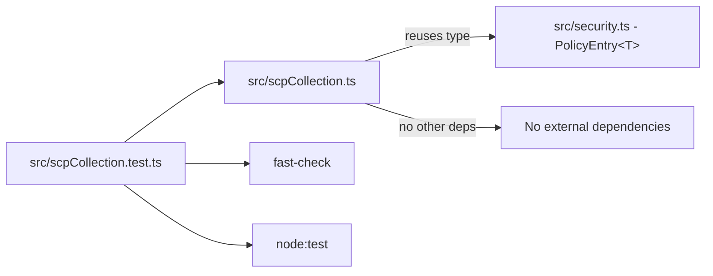

# Design Document: Towards The Cloud SCP Collection

## Overview

This feature implements a reusable SCP (Service Control Policy) collection module based on the [TowardsTheCloud 28 production-ready SCP examples](https://towardsthecloud.com/blog/aws-scp-examples). The module follows the existing `PolicyEntry<T>` pattern established in `src/security.ts` and exports a `toScpCollection<T, A>()` factory function that returns SCP rule functions organized by OU category.

The design mirrors the existing `toPolicies<T, A>()` convention — a generic factory function that returns an object of grouped policy-generating functions. Each function accepts a typed options object and returns a `PolicyEntry<T>` containing `name`, `description`, `content` (the IAM policy document), and `targets`.

### Design Decisions

1. **Separate module file** (`src/scpCollection.ts`): Keeps the existing `security.ts` focused on its current responsibilities while allowing the SCP collection to grow independently.
2. **Single factory function pattern**: Matches `toPolicies<T, A>()` — consumers destructure what they need.
3. **Consistent options pattern**: Every function accepts `{ targets?: Array<T>; name?: string; ... }` with sensible defaults.
4. **Validation at the boundary**: Functions that require parameters (e.g., `allowedRegions`, `exemptRoles`, `organizationId`) throw descriptive `Error` messages on invalid input rather than producing malformed policies.
5. **No shared mutable state**: All functions are pure — they take options and return a `PolicyEntry<T>`.

## Architecture

```mermaid
graph TD
    A[Consumer Code] -->|"import { toScpCollection } from './scpCollection.js'"| B[toScpCollection&lt;T, A&gt;]
    B --> C[foundation]
    B --> D[security]
    B --> E[production]
    B --> F[development]
    B --> G[sandbox]
    B --> H[suspended]
    B --> I[infrastructure]
    B --> J[modern]

    C --> C1[denyRootUser]
    C --> C2[denyUnsupportedRegions]
    C --> C3[enforceS3BucketOwnerEnforced]
    C --> C4[preventLeavingOrganization]
    C --> C5[denyIamUserCreation]
    C --> C6[preventDisablingEbsEncryption]
    C --> C7[protectPasswordPolicy]
    C --> C8[enforceDataPerimeter]

    D --> D1[protectSecurityServicesComprehensive]
    D --> D2[protectSecurityHubConfig]
    D --> D3[restrictToSecurityOperations]
    D --> D4[enforceMfaForIam]

    E --> E1[enforceEncryption]
    E --> E2[preventUnauthorizedTermination]
    E --> E3[protectTaggedStacks]
    E --> E4[enforceImdsV2]

    F --> F1[preventExpensiveInstances]
    F --> F2[blockReservedPurchases]
    F --> F3[preventExpensiveAiMl]
    F --> F4[enforceResourceTagging]

    G --> G1[restrictToBasicServices]
    G --> G2[preventExternalSharing]

    H --> H1[completeLockdown]

    I --> I1[restrictToNetworking]
    I --> I2[protectVpcFlowLogs]

    J --> J1[controlBedrockModels]
    J --> J2[restrictQDeveloperIam]
    J --> J3[requireVpcForSageMaker]
```



### Module Dependencies



The module has zero external runtime dependencies. The `PolicyEntry<T>` type is defined locally (or imported from `security.ts` if re-exported). The policy document is a plain `Record<string, unknown>` — no IAM policy library is needed for generation.

## Components and Interfaces

### Factory Function

```typescript
export function toScpCollection<T extends string, A extends string>(): ScpCollection<T, A>;
```

### Return Type

```typescript
interface ScpCollection<T extends string, A extends string> {
  foundation: {
    denyRootUser: (options?: DenyRootUserOptions<T>) => PolicyEntry<T>;
    denyUnsupportedRegions: (options: DenyUnsupportedRegionsOptions<T>) => PolicyEntry<T>;
    enforceS3BucketOwnerEnforced: (options?: BaseOptions<T>) => PolicyEntry<T>;
    preventLeavingOrganization: (options?: BaseOptions<T>) => PolicyEntry<T>;
    denyIamUserCreation: (options?: DenyIamUserCreationOptions<T>) => PolicyEntry<T>;
    preventDisablingEbsEncryption: (options?: BaseOptions<T>) => PolicyEntry<T>;
    protectPasswordPolicy: (options: ProtectPasswordPolicyOptions<T>) => PolicyEntry<T>;
    enforceDataPerimeter: (options: EnforceDataPerimeterOptions<T>) => PolicyEntry<T>;
  };
  security: {
    protectSecurityServicesComprehensive: (
      options: ExemptRolesRequiredOptions<T>,
    ) => PolicyEntry<T>;
    protectSecurityHubConfig: (options: ExemptRolesRequiredOptions<T>) => PolicyEntry<T>;
    restrictToSecurityOperations: (options?: BaseOptions<T>) => PolicyEntry<T>;
    enforceMfaForIam: (options?: EnforceMfaForIamOptions<T>) => PolicyEntry<T>;
  };
  production: {
    enforceEncryption: (options?: BaseOptions<T>) => PolicyEntry<T>;
    preventUnauthorizedTermination: (
      options: PreventUnauthorizedTerminationOptions<T>,
    ) => PolicyEntry<T>;
    protectTaggedStacks: (options: ProtectTaggedStacksOptions<T>) => PolicyEntry<T>;
    enforceImdsV2: (options?: BaseOptions<T>) => PolicyEntry<T>;
  };
  development: {
    preventExpensiveInstances: (options?: PreventExpensiveInstancesOptions<T>) => PolicyEntry<T>;
    blockReservedPurchases: (options?: BaseOptions<T>) => PolicyEntry<T>;
    preventExpensiveAiMl: (options?: BaseOptions<T>) => PolicyEntry<T>;
    enforceResourceTagging: (options?: EnforceResourceTaggingOptions<T>) => PolicyEntry<T>;
  };
  sandbox: {
    restrictToBasicServices: (options?: RestrictToBasicServicesOptions<T>) => PolicyEntry<T>;
    preventExternalSharing: (options?: BaseOptions<T>) => PolicyEntry<T>;
  };
  suspended: {
    completeLockdown: (options: CompleteLockdownOptions<T>) => PolicyEntry<T>;
  };
  infrastructure: {
    restrictToNetworking: (options?: BaseOptions<T>) => PolicyEntry<T>;
    protectVpcFlowLogs: (options?: ProtectVpcFlowLogsOptions<T>) => PolicyEntry<T>;
  };
  modern: {
    controlBedrockModels: (options?: ControlBedrockModelsOptions<T>) => PolicyEntry<T>;
    restrictQDeveloperIam: (options?: BaseOptions<T>) => PolicyEntry<T>;
    requireVpcForSageMaker: (options?: BaseOptions<T>) => PolicyEntry<T>;
  };
}
```

### Shared Option Types

```typescript
type PolicyEntry<T extends string> = {
  name: string;
  description: string;
  content: Record<string, unknown>;
  targets: Array<T>;
};

interface BaseOptions<T extends string> {
  targets?: Array<T>;
  name?: string;
}

interface ExemptRolesOptionalOptions<T extends string> extends BaseOptions<T> {
  exemptRoles?: Array<string>;
}

interface ExemptRolesRequiredOptions<T extends string> extends BaseOptions<T> {
  exemptRoles: Array<string>;
}
```

### Category-Specific Option Types

```typescript
interface DenyRootUserOptions<T extends string> extends BaseOptions<T> {}

interface DenyUnsupportedRegionsOptions<T extends string> extends BaseOptions<T> {
  allowedRegions: Array<string>;
  exemptRoles?: Array<string>;
}

interface DenyIamUserCreationOptions<T extends string> extends BaseOptions<T> {
  exemptRoles?: Array<string>;
}

interface ProtectPasswordPolicyOptions<T extends string> extends BaseOptions<T> {
  exemptRoles: Array<string>;
}

interface EnforceDataPerimeterOptions<T extends string> extends BaseOptions<T> {
  organizationId: string;
  exemptRoles?: Array<string>;
}

interface EnforceMfaForIamOptions<T extends string> extends BaseOptions<T> {
  exemptRoles?: Array<string>;
}

interface PreventUnauthorizedTerminationOptions<T extends string> extends BaseOptions<T> {
  approvedRoles: Array<string>;
}

interface ProtectTaggedStacksOptions<T extends string> extends BaseOptions<T> {
  organizationTagValue: string;
  exemptRoles: Array<string>;
  tagKey?: string;
}

interface PreventExpensiveInstancesOptions<T extends string> extends BaseOptions<T> {
  allowedEc2InstanceTypes?: Array<string>;
  allowedRdsInstanceClasses?: Array<string>;
  denyNatGateway?: boolean;
  denyIo2Volumes?: boolean;
}

interface EnforceResourceTaggingOptions<T extends string> extends BaseOptions<T> {
  requiredTags?: Array<string>;
}

interface RestrictToBasicServicesOptions<T extends string> extends BaseOptions<T> {
  allowedServices?: Array<string>;
  allowedInstanceTypes?: Array<string>;
}

interface CompleteLockdownOptions<T extends string> extends BaseOptions<T> {
  exemptRoles: Array<string>;
}

interface ProtectVpcFlowLogsOptions<T extends string> extends BaseOptions<T> {
  exemptRoles?: Array<string>;
}

interface ControlBedrockModelsOptions<T extends string> extends BaseOptions<T> {
  deniedModelPatterns?: Array<string>;
}
```

### Internal Helpers

```typescript
function buildExemptRolesCondition(roles: Array<string>): Record<string, unknown> | undefined;
function buildPolicyDocument(statements: Array<Record<string, unknown>>): Record<string, unknown>;
```

- `buildExemptRolesCondition`: Returns `{ StringNotLike: { "aws:PrincipalARN": roles } }` when roles is non-empty, `undefined` otherwise. Used by every function that accepts `exemptRoles`.
- `buildPolicyDocument`: Wraps statements in `{ Version: "2012-10-17", Statement: [...] }`.

## Data Models

### PolicyEntry Output Structure

Every function returns a `PolicyEntry<T>`:

```typescript
{
  name: string; // SCP display name (e.g., "DenyRootUser")
  description: string; // Human-readable description of what the SCP does
  content: {
    Version: "2012-10-17";
    Statement: Array<{
      Sid: string;
      Effect: "Deny";
      Action: string | Array<string>; // OR NotAction for allowlist-style SCPs
      Resource: string | Array<string>;
      Condition?: Record<string, Record<string, string | Array<string>>>;
    }>;
  }
  targets: Array<T>; // OU names to attach this SCP to
}
```

### IAM Policy Statement Patterns

The SCP collection uses four statement patterns:

1. **Simple Deny**: `Effect: Deny, Action: [...], Resource: "*"`
2. **Deny with Condition**: Same as above plus a `Condition` block (e.g., `StringNotLike` for exempt roles, `BoolIfExists` for MFA)
3. **Deny with NotAction**: `Effect: Deny, NotAction: [...], Resource: "*"` — allows only listed actions
4. **Deny with Resource ARN**: `Effect: Deny, Action: [...], Resource: "arn:..."` — targets specific resource types

### Condition Key Patterns

| Pattern            | Condition Key                                                              | Use Case                                |
| ------------------ | -------------------------------------------------------------------------- | --------------------------------------- |
| Exempt roles       | `aws:PrincipalARN` via `StringNotLike`                                     | Allow specific roles to bypass the deny |
| Region restriction | `aws:RequestedRegion` via `StringNotEquals`                                | Restrict to allowed regions             |
| MFA required       | `aws:MultiFactorAuthPresent` via `BoolIfExists`                            | Require MFA for sensitive ops           |
| Encryption         | `ec2:Encrypted`, `s3:x-amz-server-side-encryption`, `rds:StorageEncrypted` | Enforce encryption                      |
| Org perimeter      | `aws:PrincipalOrgID` via `StringNotEqualsIfExists`                         | Restrict to org principals              |
| Instance type      | `ec2:InstanceType` via `StringNotLike`                                     | Restrict allowed instance types         |
| Tag enforcement    | `aws:RequestTag/<key>` via `Null`                                          | Require tags on creation                |
| Resource tag       | `aws:ResourceTag/<key>` via `StringEquals`                                 | Protect tagged resources                |
| IMDSv2             | `ec2:MetadataHttpTokens` via `StringNotEquals`                             | Require IMDSv2                          |
| Called via         | `aws:CalledViaFirst` via `StringEquals`                                    | Restrict actions from chat interfaces   |
| VPC required       | `sagemaker:VpcSubnets` via `Null`                                          | Require VPC config                      |
| Object ownership   | `s3:x-amz-object-ownership` via `StringNotEquals`                          | Enforce bucket owner enforced           |
| Root identity      | `aws:PrincipalArn` via `StringLike`                                        | Match root user                         |

## Correctness Properties

_A property is a characteristic or behavior that should hold true across all valid executions of a system — essentially, a formal statement about what the system should do. Properties serve as the bridge between human-readable specifications and machine-verifiable correctness guarantees._

### Property 1: Valid IAM policy document structure

_For any_ SCP function in the collection invoked with valid options, the returned `content` field SHALL be a valid IAM policy document containing `Version: "2012-10-17"` and a non-empty `Statement` array where every statement has `Sid`, `Effect`, and `Resource` fields, and at least one of `Action` or `NotAction`.

**Validates: Requirements 30.3**

### Property 2: PolicyEntry shape consistency

_For any_ SCP function invoked with valid options, the return value SHALL contain exactly the fields `name` (non-empty string), `description` (non-empty string), `content` (object with Version and Statement), and `targets` (non-empty array of strings).

**Validates: Requirements 1.2, 1.5**

### Property 3: Default targets fallback

_For any_ SCP function invoked without a `targets` option, the returned `targets` array SHALL equal `["root"]`.

**Validates: Requirements 30.1**

### Property 4: Custom name and targets passthrough

_For any_ SCP function and any non-empty string `customName` and non-empty array `customTargets`, when invoked with `{ name: customName, targets: customTargets }`, the returned `name` SHALL equal `customName` and the returned `targets` SHALL equal `customTargets`.

**Validates: Requirements 2.3, 30.1**

### Property 5: Exempt roles condition generation

_For any_ SCP function that accepts an optional `exemptRoles` parameter, when `exemptRoles` is a non-empty array of ARN-like strings, every Deny statement in the returned policy SHALL contain a `Condition` block with `StringNotLike` on `aws:PrincipalARN` listing exactly those patterns. When `exemptRoles` is omitted or empty, no `StringNotLike` condition on `aws:PrincipalARN` SHALL be present.

**Validates: Requirements 30.2, 30.4, 30.5, 3.3, 3.5, 6.3, 6.4**

### Property 6: Region restriction round-trip

_For any_ non-empty array of valid AWS region strings, calling `foundation.denyUnsupportedRegions({ allowedRegions })` SHALL produce a policy where the `StringNotEquals` condition on `aws:RequestedRegion` contains exactly the same set of region strings that were provided.

**Validates: Requirements 3.1, 3.4**

### Property 7: Required parameter validation

_For any_ function with a required non-empty array parameter (e.g., `exemptRoles` on `protectPasswordPolicy`, `approvedRoles` on `preventUnauthorizedTermination`), calling the function with an empty array SHALL throw an `Error` with a descriptive message.

**Validates: Requirements 8.3, 10.4, 15.3, 16.6, 24.2, 27.4**

### Property 8: Organization ID validation

_For any_ empty, null, or undefined `organizationId` value passed to `foundation.enforceDataPerimeter`, the function SHALL throw an `Error` indicating that organizationId is required.

**Validates: Requirements 9.3**

### Property 9: Development instance type filtering

_For any_ non-empty array of EC2 instance type patterns, calling `development.preventExpensiveInstances({ allowedEc2InstanceTypes })` SHALL produce a Deny statement on `ec2:RunInstances` with a condition that denies types NOT in the provided pattern list.

**Validates: Requirements 18.1, 18.2**

### Property 10: Tag enforcement null condition

_For any_ non-empty array of tag key names, calling `development.enforceResourceTagging({ requiredTags })` SHALL produce Deny statements where the `Null` condition contains entries for `aws:RequestTag/<key>` set to `"true"` for each key in the input.

**Validates: Requirements 21.1**

### Property 11: SCP size constraint

_For any_ SCP function invoked with realistic options (up to 10 exempt roles, up to 5 regions), the JSON serialization of the `content` field SHALL be under 5120 characters (the AWS SCP size limit).

**Validates: Requirements 30.3** (implicit — generated policies must be deployable)

## Error Handling

### Input Validation

All validation occurs at function entry. Functions throw plain `Error` with descriptive messages:

| Scenario                              | Error Message Pattern                                                                     |
| ------------------------------------- | ----------------------------------------------------------------------------------------- |
| Required `exemptRoles` empty          | `"{functionName}: exemptRoles must contain at least one IAM role ARN pattern"`            |
| Required `approvedRoles` empty        | `"{functionName}: approvedRoles must contain at least one role ARN pattern"`              |
| Required `allowedRegions` empty       | `"denyUnsupportedRegions: allowedRegions must contain at least one region"`               |
| Required `organizationId` missing     | `"enforceDataPerimeter: organizationId is required"`                                      |
| Required `requiredTags` empty         | `"enforceResourceTagging: requiredTags must contain at least one tag key"`                |
| Required `organizationTagValue` empty | `"protectTaggedStacks: organizationTagValue and exemptRoles are both required"`           |
| Required `deniedModelPatterns` empty  | `"controlBedrockModels: deniedModelPatterns must contain at least one model ARN pattern"` |

### No Runtime Errors

Since all functions are pure and produce static JSON structures, there are no runtime failure modes beyond input validation. No network calls, file I/O, or async operations are involved.

## Testing Strategy

### Property-Based Tests (`src/scpCollection.test.ts`)

Property-based testing with `fast-check` is the primary testing approach for this module. The functions are pure, take structured inputs, and return structured outputs — ideal for PBT.

**Library**: `fast-check` (already in devDependencies)
**Runner**: `node --test`
**Minimum iterations**: 100 per property

Each property test will:

1. Generate random valid options using `fast-check` arbitraries
2. Invoke the SCP function
3. Assert the structural property holds

**Generators needed**:

- `arbTargets`: Non-empty array of non-empty strings (OU names)
- `arbExemptRoles`: Array of strings matching `arn:aws:iam::*:role/*` patterns
- `arbRegions`: Non-empty array from a known list of AWS region identifiers
- `arbTagKeys`: Non-empty array of alphanumeric strings (tag key names)
- `arbOrganizationId`: String matching `o-[a-z0-9]{10,32}`
- `arbInstanceTypes`: Array of strings matching EC2 instance type patterns

### Unit Tests (example-based)

Complement property tests with specific examples for:

- Each function returns the correct default `name` value
- Specific deny actions match requirements (e.g., `denyRootUser` denies `*` on `*`)
- `NotAction` lists contain all required global service prefixes for region restriction
- Multi-statement policies (e.g., `enforceEncryption`) contain the expected number of statements
- Boolean options (`denyNatGateway`, `denyIo2Volumes`) correctly include/omit statements

### Test File Structure

```
src/scpCollection.test.ts        — example-based unit tests
src/scpCollectionProperty.test.ts — property-based tests
```

This follows the existing project convention (e.g., `remoteStateCacheProperty.test.ts`, `tagsProperty.test.ts`).
