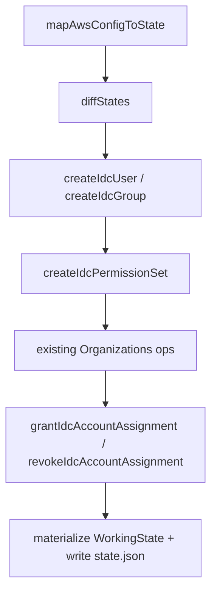

# Phase 6 Wave 2: IAM Identity Center Reconciliation Plan

This document captures the agreed broader Wave 2 scope for replacing the current
`idcAssignmentChanged` unsupported diff with real `plan` / `apply` support.

Status note: repository head has since shipped the follow-up Wave 3 group
membership work. This document still records the Wave 2 boundary as originally
planned.

## Goal

Support config-driven IAM Identity Center reconciliation for:

- creating missing users
- creating missing groups
- creating missing permission sets
- granting account assignments
- revoking account assignments

while preserving:

- schema-first operation modeling
- deterministic plan/apply output
- sequential apply execution
- partial-failure persistence to `state.json`

## Explicitly out of scope

This increment does **not** include:

- removing users, groups, or permission sets
- editing user/group metadata after creation
- editing permission set metadata after creation
- permission set policy / attachment management
- group membership management

## Why the current `idcAssignmentChanged` is insufficient

Today the system flattens assignments into state tuples and then compares the
sorted current/next sets. Any difference becomes one coarse unsupported diff:

- `IdC account assignments changed`

That blocks all useful reconciliation scenarios:

- assign an existing permission set to an account
- remove a stale assignment
- create a new user and grant access in one apply run
- create a new permission set and assign it in the same batch

Wave 2 should replace this coarse diff with granular operations.

## Operation model

Add these operations in `src/operations.ts`:

- `createIdcUser`
- `createIdcGroup`
- `createIdcPermissionSet`
- `grantIdcAccountAssignment`
- `revokeIdcAccountAssignment`

Prefer granular assignment operations over a bulk `setIdcAssignments` operation.
That fits the current apply model better:

- logs stay readable
- failure boundaries stay small
- partial persistence remains accurate
- mixed AWS Organizations + IdC batches stay debuggable

Assignment operations should be primarily **name-based**:

- `accountName`
- `permissionSetName`
- `principalType`
- `principalName`

Resolved ids / arns may be attached for execution or logging, but the logical
operation identity should stay aligned with config intent rather than the
temporary `__pending_creation__` sentinel values.

## Locked design decisions

These decisions are now considered locked for Wave 2 planning unless explicitly
reopened:

1. Broad scope is approved:
   - create missing IdC users
   - create missing IdC groups
   - create missing IdC permission sets
   - grant assignments
   - revoke assignments
2. Assignment reconciliation uses **granular operations**, not a bulk
   `setIdcAssignments` operation.
3. Assignment operations stay primarily **name-based**, with apply resolving
   concrete ids / arns from the evolving working state.
4. Operation order is part of correctness, not just deterministic output.
5. Execution priority is assigned during plan generation and used to sort
   operations before apply runs them.
6. Grants sort before revokes.

## Execution ordering

Wave 2 should make ordering explicit by assigning an internal execution priority
per operation kind during plan generation in `diffStates`.

Recommended priority order:

1. `createOu`
2. `renameOu`
3. `createAccount`
4. `moveAccount`
5. `createIdcUser`
6. `createIdcGroup`
7. `createIdcPermissionSet`
8. `grantIdcAccountAssignment`
9. `revokeIdcAccountAssignment`

Notes:

- apply should execute the already-sorted plan as-is; it should not invent a
  second ordering pass
- operations should still use a stable secondary sort key inside each priority
  bucket so output remains deterministic
- priority is intended as an internal planning concern; it does not need to be
  exposed as part of the public operation schema unless we later decide that
  `plan --json` should include execution priority explicitly

## Diff strategy

### Entity additions

Map these unsupported diffs to real operations:

- new user -> `createIdcUser`
- new group -> `createIdcGroup`
- new permission set -> `createIdcPermissionSet`

### Assignment reconciliation

Replace the coarse `idcAssignmentChanged` fallback with **name-based**
set-difference logic.

Locked decision:

- IdC diffing should not rely purely on the mapped state tuples containing
  `__pending_creation__`
- the shared sentinel is safe enough for current mapping, but it is too coarse
  to act as the canonical diff identity for newly introduced IdC entities
- Wave 2 should therefore compare a normalized **name-based** IdC view rather
  than diffing only the flattened mapped tuples

Build a normalized desired/current IdC comparison layer:

- users keyed by `userName`
- groups keyed by `displayName`
- permission sets keyed by `name`
- assignments keyed by:
  - `accountName`
  - `permissionSetName`
  - `principalType`
  - `principalName`

Current-state assignments should be reverse-resolved from ids / arns to names
using the scanned state lookups before diffing.

Then emit operations from set differences:

- `(accountId, permissionSetArn, principalId, principalType)` present in `next`
  but not in `current` -> `grantIdcAccountAssignment`
- present in `current` but not in `next` -> `revokeIdcAccountAssignment`

Because config is name-based while state is id-based, the diff layer should keep
the user-facing operation fields name-based and rely on apply-time resolution
against the evolving working state.

In practical terms, the grant/revoke operations should be emitted from these
name-based set differences:

- desired assignment missing in current -> `grantIdcAccountAssignment`
- current assignment missing in desired -> `revokeIdcAccountAssignment`

### What remains unsupported after this wave

- removed user
- removed group
- removed permission set

Those should stay as destructive unsupported diffs until we explicitly plan
entity deletion behavior.

### Suppression rule for downstream assignment noise

This step is also locked:

- if a user / group / permission set is removed from config, that entity removal
  remains unsupported
- assignment revokes caused *only* by that unsupported entity removal should be
  suppressed from the operation plan

Reason:

- otherwise the tool would partially implement unsupported entity deletion by
  revoking its assignments while still refusing the root mutation
- the plan would become noisy and misleading

So the diff layer should prefer:

1. emit the unsupported entity-removal diff
2. suppress derivative revoke operations whose only cause is that unsupported
   removal

### Scope boundary with existing Organizations diff

Organizations reconciliation should keep using the current state-vs-state diff
path. The name-based normalization rule is specific to Wave 2 IdC diffing.

## Working-state refactor

`WorkingState` in `src/state.ts` currently indexes only organization entities.
Wave 2 needs equivalent IdC indexes so later operations can resolve real ids
created earlier in the same apply run.

Add indexed IdC state such as:

- users by `userName`
- groups by `displayName`
- permission sets by `name`
- account assignments by natural assignment key

Add immutable helpers for:

- upserting a created user
- upserting a created group
- upserting a created permission set
- adding an assignment
- removing an assignment
- regenerating `accessRoles` from assignments

This should follow the same repository rule already used for organization state:

1. convert persisted arrays to indexed working state once
2. update immutably during apply
3. materialize back to arrays once before persistence

Locked Step 3 decisions:

1. Persisted `StateFile` shape stays unchanged.
2. `WorkingState` gains IdC indexes in addition to canonical IdC arrays.
3. Apply-time IdC dependency resolution must use the **current working state**
   rather than stale planned sentinelized values.
4. `accessRoles` remains derived from `accountAssignments`; it should not become
   an independently authored or independently mutated structure.
5. Helper functions must update arrays and indexes immutably together.

Recommended in-memory IdC indexes:

- users by `userName`
- groups by `displayName`
- permission sets by `name`
- account assignments by natural assignment key

Recommended natural assignment key:

- `accountId`
- `permissionSetArn`
- `principalId`
- `principalType`

The main motivation for this step is correctness during mixed Wave 1 + Wave 2
apply runs, for example:

- create account -> grant assignment to that new account
- create user -> grant assignment to that new user
- create permission set -> grant assignment using the new permission set arn

Those later operations must resolve against the **updated** working state after
earlier operations succeed.

Explicit non-goal:

- do not introduce an extra pending-id tracking system or a second sentinel
  identity model just for Wave 2

Step 2 already locked name-based diffing, so Step 3 should focus only on
efficient immutable resolution and persistence boundaries.

## Apply execution model

Wave 2 requires both `SSOAdminClient` and `IdentitystoreClient` inside
`runApplyCommand`.

Execution should stay sequential and update working state immediately after each
successful operation.

### AWS API plan

- `createIdcUser`
  - `CreateUser`
- `createIdcGroup`
  - `CreateGroup`
- `createIdcPermissionSet`
  - `CreatePermissionSet`
- `grantIdcAccountAssignment`
  - `CreateAccountAssignment`
  - poll `DescribeAccountAssignmentCreationStatus`
- `revokeIdcAccountAssignment`
  - `DeleteAccountAssignment`
  - poll `DescribeAccountAssignmentDeletionStatus`

Locked Step 4 decisions:

1. Wave 2 apply keeps the existing Wave 1 execution contract:
   - sequential execution
   - one operation at a time
   - stop on first failure
   - persist partial `state.json`
   - instruct the user to run `scan` and retry
2. Working state is updated **only after confirmed success** for each operation.
3. Assignment grant / revoke are asynchronous operations and are not considered
   successful until status polling reaches terminal success.
4. Polling timeout is treated as an operation failure.
5. Mixed Organizations + IdC dependency batches are supported in one apply run.
6. `createIdcPermissionSet` should assume the initial create-and-assign flow can
   proceed without an explicit provisioning step before the first downstream
   assignment grant.

### Per-operation success model

`createIdcUser`

- call `CreateUser`
- success requires a real returned `userId`
- only then update working state

`createIdcGroup`

- call `CreateGroup`
- success requires a real returned `groupId`
- only then update working state

`createIdcPermissionSet`

- call `CreatePermissionSet`
- success requires a real returned `permissionSetArn`
- only then update working state as a fully usable permission set

`grantIdcAccountAssignment`

- call `CreateAccountAssignment`
- poll `DescribeAccountAssignmentCreationStatus`
- mutate working state only after terminal success

`revokeIdcAccountAssignment`

- call `DeleteAccountAssignment`
- poll `DescribeAccountAssignmentDeletionStatus`
- mutate working state only after terminal success

### Polling model

Wave 2 should mirror the existing account-creation helper runtime pattern:

- runtime-configured timeout
- runtime-configured poll interval
- log status transitions, not every poll iteration
- fail with operation-specific context in the error message

### Important apply nuance

Newly created users / groups / permission sets will not have real ids / arns at
diff time. That means apply must resolve assignment dependencies against the
**current working state**, not against the original planned-next-state sentinel
values.

This is the main reason to keep assignment operations name-based.

The same rule applies to execution ordering:

- entity-creation work must run before assignment grants that depend on those
  newly created ids / arns
- Organizations account creation must run before assignment grants that target
  newly created accounts
- revocations should run after grants so replacement-style edits minimize
  temporary access loss

Mixed dependency scenarios inside a single apply run are explicitly supported,
for example:

- create account -> grant assignment to the new account
- create user -> grant assignment to the new user
- create permission set -> grant assignment using the new permission set arn

## Locked AWS behavior for permission set creation

AWS documentation confirms this Wave 2 behavior:

- for an initial create-and-assign flow, `CreatePermissionSet` can be followed
  directly by `CreateAccountAssignment`
- `CreateAccountAssignment` performs the provisioning needed for that initial
  assignment flow
- explicit `ProvisionPermissionSet` is **not** required before the first account
  assignment

So for this increment, `createIdcPermissionSet` should assume the minimum viable
support matches the current config model:

- create the permission set with `name` + `description`
- do not yet reconcile inline policy, managed policies, or permission boundary

`ProvisionPermissionSet` becomes relevant later only if we add support for
updating existing permission sets and need to push those updates out to already
provisioned accounts.

## Locked operation payload shapes

Wave 2 operation payloads should stay minimal, name-based, and execution
oriented.

Locked shapes:

- `createIdcUser`
  - `userName`
  - `displayName`
  - `email`
- `createIdcGroup`
  - `groupDisplayName`
- `createIdcPermissionSet`
  - `permissionSetName`
  - `description`
- `grantIdcAccountAssignment`
  - `accountName`
  - `permissionSetName`
  - `principalType`
  - `principalName`
- `revokeIdcAccountAssignment`
  - `accountName`
  - `permissionSetName`
  - `principalType`
  - `principalName`

### Payload-shape rules

1. Assignment operations use the normalized pair:
   - `principalType`
   - `principalName`

   rather than separate optional `group` / `user` fields.

2. Operation schemas do **not** carry resolved execution identifiers such as:
   - `accountId`
   - `principalId`
   - `permissionSetArn`

   Those values are resolved during apply from the current working state.

3. Operation schemas do **not** expose planning metadata such as `priority`.
   Priority remains an internal planning concern used only for operation sorting.

4. Payloads should stay aligned with the current config model rather than
   mirroring raw AWS SDK input types directly.

5. `createIdcUser` uses a single config/state `email` field. Apply expands that
   to the AWS `Emails` array shape only at the `CreateUser` call site.

### Consequence for unsupported diff kinds

Once Wave 2 additions and assignment reconciliation are implemented, the old
coarse IdC unsupported kinds are no longer correct:

- `idcUserAdded`
- `idcGroupAdded`
- `idcPermissionSetAdded`
- `idcAssignmentChanged`

Remaining IdC unsupported kinds should instead describe only the still
out-of-scope removals:

- `idcUserRemoved`
- `idcGroupRemoved`
- `idcPermissionSetRemoved`

## CLI and runtime changes

Update `src/cli.ts` and `src/commands/apply.ts` so apply receives:

- `OrganizationsClient`
- `SSOAdminClient`
- `IdentitystoreClient`
- runtime polling config for assignment create/delete status checks

Keep:

- `--ignore-unsupported` behavior unchanged
- destructive safety rules unchanged
- apply confirmation prompt unchanged

## README and IAM policy updates

Update `README.md` to document:

- Wave 2 supported IdC actions
- that assignment revocations are supported in this wave
- the additional IAM Identity Center / Identity Store permissions needed

Expected new apply permissions include at least:

- `identitystore:CreateUser`
- `identitystore:CreateGroup`
- `sso:CreatePermissionSet`
- `sso:CreateAccountAssignment`
- `sso:DeleteAccountAssignment`
- `sso:DescribeAccountAssignmentCreationStatus`
- `sso:DescribeAccountAssignmentDeletionStatus`

If implementation requires additional provisioning APIs, add them to the README
only after the exact command usage is confirmed in code.

## Tests

### `src/operations.test.ts` (new)

- schema coverage for all new IdC operations

### `src/diff.test.ts`

- emits `createIdcUser` for new users
- emits `createIdcGroup` for new groups
- emits `createIdcPermissionSet` for new permission sets
- emits `grantIdcAccountAssignment` for additive assignment diffs
- emits `revokeIdcAccountAssignment` for removed assignment diffs
- keeps user/group/permission-set removals unsupported
- keeps deterministic ordering for mixed Organizations + IdC operations

### `src/commands/plan.test.ts`

- human-readable lines for all new IdC operations
- JSON output remains schema-compatible and deterministic

### `src/commands/apply.test.ts`

- create user / group / permission set AWS input assertions
- assignment grant / revoke input assertions
- state persistence after successful IdC operations
- partial failure with mixed successful IdC operations before later failure
- mixed Organizations + IdC batch behavior
- in-batch dependency scenario:
  - create user/group/permission set
  - then grant assignment using the newly returned ids / arns

## Manual smoke tests

Completed during implementation validation:

After implementation, run these real scenarios:

1. Add a new user and grant an existing permission set on an existing account.
2. Add a new permission set and assign it to an existing group and account.
3. Revoke one existing assignment and confirm `plan` becomes clean after
   `apply`.
4. Create a new AWS account and assign a permission set to it in the same batch.
5. Re-run `scan` after each scenario and confirm `plan` reports
   `0 operation(s), 0 unsupported diff(s)`.

## Suggested implementation order

1. Expand operation schemas and add schema tests.
2. Replace coarse IdC unsupported diffs with granular operation emission.
3. Extend `WorkingState` with IdC indexes and immutable helpers.
4. Add apply execution for IdC principal and permission-set creation.
5. Add async assignment grant / revoke execution with status polling.
6. Add plan/apply output formatting and CLI wiring.
7. Update README / IAM policy and run full regression + smoke validation.

## Checklist

- [x] Lock broad Wave 2 scope in `docs/phase-6-plan.md`.
- [x] Lock fixed execution ordering and planning-time priority model.
- [x] Lock name-based IdC diff strategy and derivative-revoke suppression rules.
- [x] Lock WorkingState IdC index strategy and apply-time resolution rules.
- [x] Lock apply execution contract, polling rules, and mixed dependency behavior.
- [x] Lock AWS create-permission-set vs provision-permission-set behavior for initial assignment flows.
- [x] Lock IdC operation payload shapes and unsupported-kind cleanup.
- [x] Add IdC operation schemas and tests.
- [x] Implement granular IdC diff emission.
- [x] Extend working state for IdC entities and assignments.
- [x] Implement IdC apply execution with status polling.
- [x] Update plan/apply output and CLI runtime wiring.
- [x] Update README supported actions and IAM permissions.
- [x] Add regression coverage for mixed success / failure and dependency batches.
- [x] Define and run manual smoke tests.
